# TipoBot Database Design

PostgreSQL schema for the hardware store platform, implemented as typed
SQLAlchemy 2 models and versioned with Alembic. This document describes the
schema design, conventions, and an ER diagram.

See also: [ARCHITECTURE.md](ARCHITECTURE.md) for how these models fit into
the backend's layering, [API.md](API.md) for the REST surface built on top
of them, and [CATALOG.md](CATALOG.md) for a deep dive on every catalog
subsystem (product types, attributes, pricing, inventory, search).

## Conventions

Every table inherits from `app.models.mixins.Entity`
([backend/app/models/mixins.py](backend/app/models/mixins.py)), which
guarantees a consistent shape across the entire schema:

| Column       | Type                       | Notes                                   |
|--------------|----------------------------|------------------------------------------|
| `id`         | `UUID`                     | Primary key, generated client-side (`uuid4`) |
| `created_at` | `TIMESTAMPTZ`               | Set by the database (`server_default=now()`) |
| `updated_at` | `TIMESTAMPTZ`               | Refreshed on every `UPDATE` (`onupdate=now()`) |
| `deleted_at` | `TIMESTAMPTZ`, nullable     | Soft delete marker; `NULL` = not deleted |

Rows are never hard-deleted by application code — `deleted_at` is set
instead, and repositories are expected to filter `WHERE deleted_at IS NULL`.

Models are organized into **bounded contexts** rather than one flat module,
which is the Clean Architecture separation applied at the persistence layer:

```
backend/app/models/
├── mixins.py       # Entity / UUID / timestamp / soft-delete mixins
├── enums.py        # Shared Python enums mapped to native Postgres enums
├── catalog/        # Categories, Products, Product Types, Attributes, EAV,
│                    # Reference Data, Collections, Manufacturers, Units,
│                    # per-entity Translation companion tables
├── commerce/        # Carts, Orders, Promotions, Discounts, Coupons
├── users/           # Customers, AdminUsers, Roles, Permissions
├── content/          # Banners, News, StaticPages, SiteSettings, StoreSettings
└── system/           # AuditLogs, PriceHistory, UploadedFiles
```

Each domain package exposes its models through `__init__.py`; the top-level
`app.models` package re-exports everything so Alembic's `env.py`
(`from app.models import *`) can discover all tables via `Base.metadata`.

## Design decisions worth calling out

- **Categories are a single self-referential table**, not separate
  `categories` + `subcategories` tables. `categories.parent_id` references
  `categories.id`, so a "subcategory" is just a `Category` with a parent —
  this supports unlimited nesting depth instead of a fixed two-level
  hierarchy, and avoids duplicating every category column and constraint in
  a second table.
- **Product Types drive available specifications.** `ProductType` (e.g.
  "Kitchen Faucet", "Mirror") references one `AttributeSet`; `AttributeSet`
  is a reusable, named bundle of `AttributeDefinition`s via the
  `AttributeSetItem` join, which carries **per-set** metadata (`sort_order`,
  `is_required`, `is_visible`, `default_value`). This separation — global
  attribute properties (data type, unit, validation) on `AttributeDefinition`
  vs. per-set membership properties on `AttributeSetItem` — lets the same
  "Material" attribute be required in one set and optional in another, and
  lets several product types with overlapping specs (Kitchen/Bathroom/Outdoor
  Faucet) share one `AttributeSet` instead of duplicating it. Changing a
  product's `product_type_id` re-syncs its `ProductAttribute` rows against
  the new type's set — see [CATALOG.md](CATALOG.md).
- **Product attributes use an EAV (entity-attribute-value) pattern**:
  `attribute_definitions` declares the available attributes (name, code,
  data type, optional unit — e.g. "Voltage", number, V), and
  `product_attributes` stores one typed value row per `(product,
  attribute_definition)` pair, with a typed column per `AttributeDataType`
  (`value_string`/`value_number`/`value_boolean`/`value_date`) plus
  `value_reference_id` for `REFERENCE`-typed attributes (see below). This
  lets any product carry an unlimited, fully dynamic set of custom
  attributes without schema changes.
- **One generic `ReferenceValue` table backs ten conceptually-distinct
  dictionaries** (materials, colors, countries, finishes, installation
  types, shapes, warranty periods, connection types, thread sizes, water
  outlet types) via a `reference_type` discriminator column plus a
  `UNIQUE(reference_type, code)` constraint, instead of ten near-identical
  tables. `AttributeDefinition.reference_type` says which dictionary a
  `REFERENCE`-typed attribute draws from; `ProductAttribute.value_reference_id`
  points at the chosen entry. Products reference dictionaries by id instead
  of storing duplicated free text, so renaming "Chrome" once updates every
  product using it.
- **Collections group products across product types.** `Collection` belongs
  to one `Manufacturer` (e.g. Grohe's "Essence" collection) and a `Product`
  optionally belongs to one `Collection`, regardless of the product's type —
  this is what lets a customer browse a manufacturer's line (faucet + mirror
  + cabinet + accessories) as a complete set.
- **Every translatable catalog entity has a companion `{entity}_translations`
  table** (`ProductTranslation`, `ProductTypeTranslation`,
  `AttributeDefinitionTranslation`, `AttributeGroupTranslation`,
  `CollectionTranslation`, `ProductLabelTranslation`,
  `ReferenceValueTranslation`), each `UNIQUE(parent_id, locale)`. This is
  the schema-level half of the translation architecture described in
  [ARCHITECTURE.md](ARCHITECTURE.md) — adding a new language is a data
  operation, not a migration.
- **`Product.status` is a three-state enum** (`DRAFT`/`ACTIVE`/`ARCHIVED`),
  not a boolean `is_active`. Draft products can be fully configured before
  going live; archived products are hidden from storefront queries and
  filters/facets without being soft-deleted.
- **`Product.search_vector` is a stored `GENERATED ALWAYS AS` column**
  (Postgres `Computed(..., persisted=True)`), a `tsvector` built from
  `name`/`sku`/`slug`/`barcode`/`description` via
  `to_tsvector('russian', ...)`, backed by a GIN index. At 100k+ rows, a
  leading-wildcard `ILIKE '%term%'` search can't use any index and degrades
  linearly with table size; the generated+indexed `tsvector` answers full-
  text queries in milliseconds regardless of catalog size, and Postgres
  keeps it in sync automatically on every write — no application code
  re-derives it.
- **Product images/documents/videos are each one row per file**
  (`product_images`, `product_documents`, `product_videos`, all FK to
  `products` with `sort_order`), so a product supports unlimited files of
  each kind natively via a one-to-many relationship, with `product_images`
  additionally carrying `is_primary` for the main image.
- **Product labels are a configurable dictionary + M2M join**, not a fixed
  enum: `product_labels` (admin-creatable, e.g. "New", "Sale") and
  `product_label_assignments` (`UNIQUE(product_id, product_label_id)`) so a
  product can carry several labels at once and new labels don't require a
  migration.
- **Price history is append-only and drives rollback.** `price_history`
  gets one row per price change (`old_price`, `new_price`, `changed_by_id`,
  optional `reason`), written automatically by `ProductService` on create/
  update/bulk-price-adjust/scheduled-activation — never by hand. Rolling
  back reads a past `price_history` row and writes a *new* row recording
  the rollback itself, so history is never mutated or deleted.
- **Order items snapshot product data** (`product_name`, `sku`,
  `unit_price` copied at purchase time, `product_id` nullable with
  `ON DELETE SET NULL`) so historical orders stay accurate even if the
  underlying product is edited or removed later.
- **`audit_logs.actor_id` and `uploaded_files.entity_id` are intentionally
  not foreign keys.** An audit log actor can be a customer, an admin user,
  or the system; an uploaded file can attach to any entity type. Both use a
  `(*_type, *_id)` pair as a loose polymorphic association instead of a
  single FK, since Postgres has no native polymorphic FK.
- **RBAC is normalized**: `roles` ⟷ `permissions` through a mapped
  `role_permissions` join entity (not a bare association table), so it
  carries the same audit/soft-delete columns as everything else.
- Foreign key `ON DELETE` behavior is chosen per relationship:
  `CASCADE` where children are meaningless without the parent (e.g. cart
  items, product images/attributes/documents/videos/translations, category
  subtree, attribute set items), `SET NULL` where the child should survive
  (e.g. order items, price history, a product's manufacturer/collection if
  that manufacturer/collection is removed, an attribute's reference value),
  and `RESTRICT` where deleting the parent should be blocked while children
  exist (e.g. a category, unit, or product type still assigned to products).

## Entity summary

**Catalog** — `manufacturers`, `units`, `categories` (self-referential),
`products`, `product_images`, `product_documents`, `product_videos`,
`attribute_definitions`, `product_attributes`, `attribute_groups`,
`attribute_sets`, `attribute_set_items`, `product_types`, `collections`,
`reference_values`, `product_labels`, `product_label_assignments`, plus the
translation companion tables: `product_translations`,
`product_type_translations`, `attribute_definition_translations`,
`attribute_group_translations`, `collection_translations`,
`product_label_translations`, `reference_value_translations`

**Commerce** — `carts`, `cart_items`, `orders`, `order_items`,
`promotions`, `discounts`, `coupons`

**Users** — `customers`, `admin_users`, `roles`, `permissions`,
`role_permissions`

**Content** — `banners`, `news`, `static_pages`, `site_settings`,
`store_settings`

**System** — `audit_logs`, `price_history`, `uploaded_files`

## Migrations

Generated with SQLAlchemy 2 typed models + `alembic revision --autogenerate`:

```
make revision m="describe the change"
make migrate
```

Current migration history (`backend/alembic/versions`):

1. `bffdc46b6cd9` — initial database schema
2. `2404140e221e` — add `store_settings` table
3. `2266f6f41f9a` — add language preference to admin users
4. `a7a032238a52` — Product Catalog Engine: product types, attribute sets/
   groups, reference values, collections, product labels, product
   documents/videos, per-entity translation tables, `Product.status` enum
   (replacing `is_active`), extended pricing/inventory/SEO columns, and the
   generated `search_vector` column. Includes a one-time bootstrap
   `AttributeSet`/`ProductType` row so the pre-existing `products` table
   could backfill a non-nullable `product_type_id`; `scripts/seed_catalog.py`
   seeds the real product types described in [CATALOG.md](CATALOG.md).

Two enum-related conventions worth remembering when hand-editing a
migration that adds an enum column to an already-populated table:
`add_column` (unlike `create_table`) does not auto-create the backing
Postgres enum type — call `postgresql.ENUM(...).create(bind, checkfirst=True)`
first — and this codebase stores each Python enum member's **name**
(uppercase) as the Postgres label, not `.value`, so
`server_default=`/backfill literals must match (`'DRAFT'`, not `'draft'`).

## ER Diagram

```mermaid
erDiagram
    MANUFACTURERS ||--o{ PRODUCTS : manufactures
    MANUFACTURERS ||--o{ COLLECTIONS : owns
    UNITS ||--o{ PRODUCTS : "measured in"
    UNITS ||--o{ ATTRIBUTE_DEFINITIONS : "measured in"
    CATEGORIES ||--o{ CATEGORIES : "parent / children"
    CATEGORIES ||--o{ PRODUCTS : contains
    CATEGORIES ||--o{ DISCOUNTS : "scoped to"

    ATTRIBUTE_SETS ||--o{ ATTRIBUTE_SET_ITEMS : bundles
    ATTRIBUTE_SETS ||--o{ PRODUCT_TYPES : "assigned to"
    ATTRIBUTE_DEFINITIONS ||--o{ ATTRIBUTE_SET_ITEMS : "included via"
    ATTRIBUTE_GROUPS ||--o{ ATTRIBUTE_DEFINITIONS : groups
    ATTRIBUTE_DEFINITIONS ||--o{ PRODUCT_ATTRIBUTES : defines
    REFERENCE_VALUES ||--o{ PRODUCT_ATTRIBUTES : "chosen for"
    PRODUCT_TYPES ||--o{ PRODUCTS : types
    COLLECTIONS ||--o{ PRODUCTS : groups

    PRODUCTS ||--o{ PRODUCT_IMAGES : has
    PRODUCTS ||--o{ PRODUCT_DOCUMENTS : has
    PRODUCTS ||--o{ PRODUCT_VIDEOS : has
    PRODUCTS ||--o{ PRODUCT_ATTRIBUTES : has
    PRODUCTS ||--o{ PRODUCT_LABEL_ASSIGNMENTS : carries
    PRODUCT_LABELS ||--o{ PRODUCT_LABEL_ASSIGNMENTS : "assigned via"
    PRODUCTS ||--o{ CART_ITEMS : "added as"
    PRODUCTS ||--o{ ORDER_ITEMS : "purchased as"
    PRODUCTS ||--o{ PRICE_HISTORY : tracks
    PRODUCTS ||--o{ DISCOUNTS : "scoped to"

    CUSTOMERS ||--o{ CARTS : owns
    CUSTOMERS ||--o{ ORDERS : places
    CARTS ||--o{ CART_ITEMS : contains
    ORDERS ||--o{ ORDER_ITEMS : contains
    ORDERS }o--o| COUPONS : redeems

    PROMOTIONS ||--o{ DISCOUNTS : defines
    PROMOTIONS ||--o{ COUPONS : backs

    ROLES ||--o{ ADMIN_USERS : "assigned to"
    ROLES ||--o{ ROLE_PERMISSIONS : grants
    PERMISSIONS ||--o{ ROLE_PERMISSIONS : "granted via"

    ADMIN_USERS ||--o{ NEWS : authors
    ADMIN_USERS ||--o{ PRICE_HISTORY : changes
    ADMIN_USERS ||--o{ UPLOADED_FILES : uploads

    MANUFACTURERS {
        uuid id PK
        string name
        string slug
        bool is_active
    }
    UNITS {
        uuid id PK
        string name
        string symbol
    }
    CATEGORIES {
        uuid id PK
        uuid parent_id FK
        string name
        string slug
        int sort_order
    }
    PRODUCT_TYPES {
        uuid id PK
        uuid attribute_set_id FK
        string code
        string name
        int sort_order
        bool is_active
    }
    ATTRIBUTE_SETS {
        uuid id PK
        string code
        string name
        string description
    }
    ATTRIBUTE_SET_ITEMS {
        uuid id PK
        uuid attribute_set_id FK
        uuid attribute_definition_id FK
        int sort_order
        bool is_required
        bool is_visible
        string default_value
    }
    ATTRIBUTE_GROUPS {
        uuid id PK
        string code
        string name
        int sort_order
    }
    REFERENCE_VALUES {
        uuid id PK
        string reference_type
        string code
        int sort_order
        bool is_active
    }
    COLLECTIONS {
        uuid id PK
        uuid manufacturer_id FK
        string code
        string slug
        string name
        string image_url
        int sort_order
        bool is_active
    }
    PRODUCTS {
        uuid id PK
        uuid category_id FK
        uuid manufacturer_id FK
        uuid unit_id FK
        uuid product_type_id FK
        uuid collection_id FK
        string sku
        string barcode
        string slug
        string name
        enum status
        numeric price
        numeric compare_at_price
        numeric cost_price
        numeric sale_price
        numeric future_price
        timestamptz future_price_activates_at
        string currency
        int stock_quantity
        int reserved_quantity
        bool is_unlimited_stock
        int low_stock_threshold
        jsonb seo
        tsvector search_vector
    }
    PRODUCT_IMAGES {
        uuid id PK
        uuid product_id FK
        string url
        int sort_order
        bool is_primary
    }
    PRODUCT_DOCUMENTS {
        uuid id PK
        uuid product_id FK
        enum document_type
        string title
        string file_url
        int sort_order
    }
    PRODUCT_VIDEOS {
        uuid id PK
        uuid product_id FK
        enum video_type
        string url
        int sort_order
    }
    ATTRIBUTE_DEFINITIONS {
        uuid id PK
        uuid unit_id FK
        uuid attribute_group_id FK
        string code
        string name
        enum data_type
        string reference_type
        bool is_filterable
    }
    PRODUCT_ATTRIBUTES {
        uuid id PK
        uuid product_id FK
        uuid attribute_definition_id FK
        uuid value_reference_id FK
        string value_string
        numeric value_number
        bool value_boolean
        datetime value_date
    }
    PRODUCT_LABELS {
        uuid id PK
        string code
        string badge_color
        int sort_order
        bool is_active
    }
    PRODUCT_LABEL_ASSIGNMENTS {
        uuid id PK
        uuid product_id FK
        uuid product_label_id FK
    }
    CUSTOMERS {
        uuid id PK
        bigint telegram_id
        string email
        string phone
        bool is_active
    }
    CARTS {
        uuid id PK
        uuid customer_id FK
        string session_token
        enum status
    }
    CART_ITEMS {
        uuid id PK
        uuid cart_id FK
        uuid product_id FK
        int quantity
        numeric unit_price
    }
    ORDERS {
        uuid id PK
        uuid customer_id FK
        uuid coupon_id FK
        string order_number
        enum status
        numeric grand_total
    }
    ORDER_ITEMS {
        uuid id PK
        uuid order_id FK
        uuid product_id FK
        string product_name
        string sku
        int quantity
        numeric line_total
    }
    PROMOTIONS {
        uuid id PK
        string name
        enum promotion_type
        bool is_active
    }
    DISCOUNTS {
        uuid id PK
        uuid promotion_id FK
        uuid category_id FK
        uuid product_id FK
        enum scope
        enum amount_type
        numeric value
    }
    COUPONS {
        uuid id PK
        uuid promotion_id FK
        string code
        enum amount_type
        numeric discount_value
        int usage_limit
        int usage_count
    }
    ROLES {
        uuid id PK
        string name
    }
    PERMISSIONS {
        uuid id PK
        string code
    }
    ROLE_PERMISSIONS {
        uuid id PK
        uuid role_id FK
        uuid permission_id FK
    }
    ADMIN_USERS {
        uuid id PK
        uuid role_id FK
        string username
        string email
        bool is_superuser
    }
    BANNERS {
        uuid id PK
        string title
        string image_url
        int sort_order
    }
    NEWS {
        uuid id PK
        uuid author_id FK
        string title
        string slug
        bool is_published
    }
    STATIC_PAGES {
        uuid id PK
        string title
        string slug
        bool is_published
    }
    SITE_SETTINGS {
        uuid id PK
        string key
        jsonb value
    }
    AUDIT_LOGS {
        uuid id PK
        enum actor_type
        uuid actor_id
        string action
        string entity_type
        uuid entity_id
    }
    PRICE_HISTORY {
        uuid id PK
        uuid product_id FK
        uuid changed_by_id FK
        numeric old_price
        numeric new_price
    }
    UPLOADED_FILES {
        uuid id PK
        uuid uploaded_by_id FK
        string file_name
        string entity_type
        uuid entity_id
    }
```



> `audit_logs.actor_id` and `uploaded_files.entity_id` are shown as plain
> columns above (not relationship arrows) because they are polymorphic
> references, not single-table foreign keys — see "Design decisions" above.
>
> The seven translation companion tables (`product_translations`,
> `product_type_translations`, `attribute_definition_translations`,
> `attribute_group_translations`, `collection_translations`,
> `product_label_translations`, `reference_value_translations`) are omitted
> from the diagram for readability — each is a plain `(parent_id FK,
> locale, <translatable columns>)` table with `UNIQUE(parent_id, locale)`,
> `ON DELETE CASCADE` from its parent. See [CATALOG.md](CATALOG.md) for the
> full localization design.
